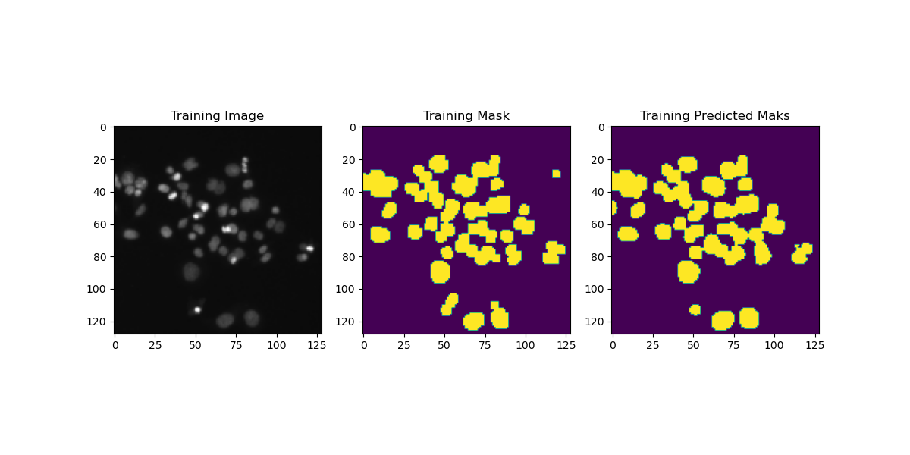
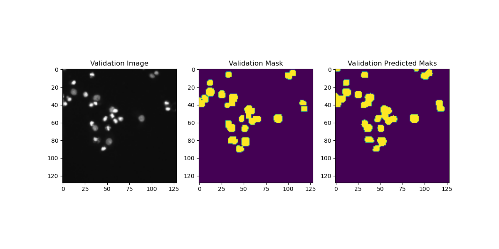
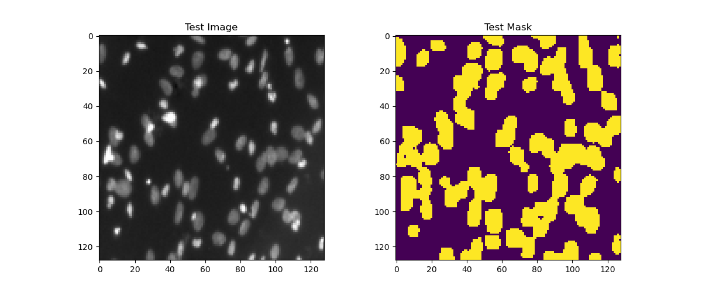

# Nuclei Biomedical Image Segementation Using UNet Model 

This project implements a UNet model for semantic segmentation of nuclei in biomedical images. The model is trained to accurately identify and segment nuclei from input images, facilitating further analysis in medical research and diagnostics.

## Key features:

- Utilizes the UNet architecture for precise segmentation
- Trained on a dataset of annotated biomedical images
- Achieves Low Loss in segmenting nuclei

## dataset

The dataset used for training and evaluation is from the [2018 Data Science Bowl](https://www.kaggle.com/competitions/data-science-bowl-2018/data) on Kaggle.  

## Result

### Predicted Training Mask

### Predicted Validation Mask

### Predicted Testing Mask

## Getting Started

Clone the repository and follow the instructions to set up the environment and run the model.

## Authors

- [@ashar-ashfaq](https://github.com/ashar-ashfaq)

